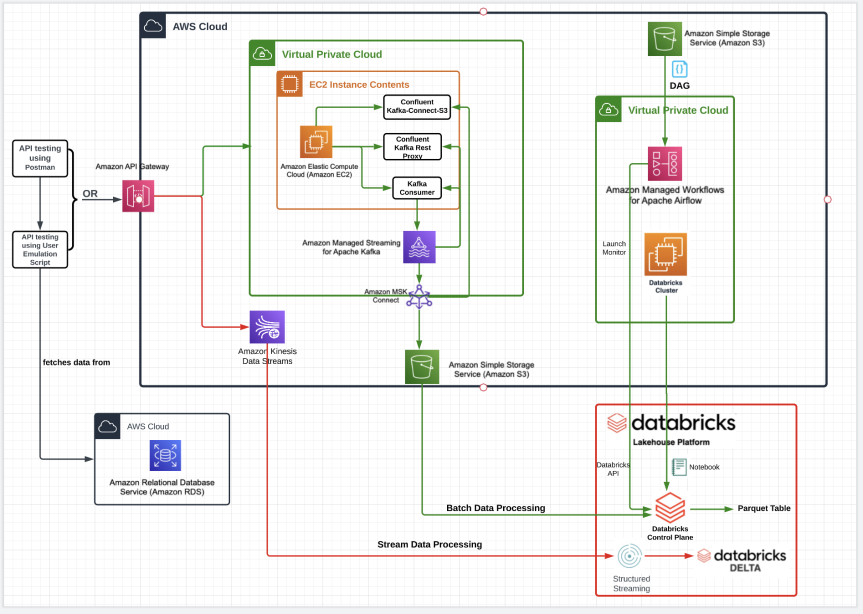
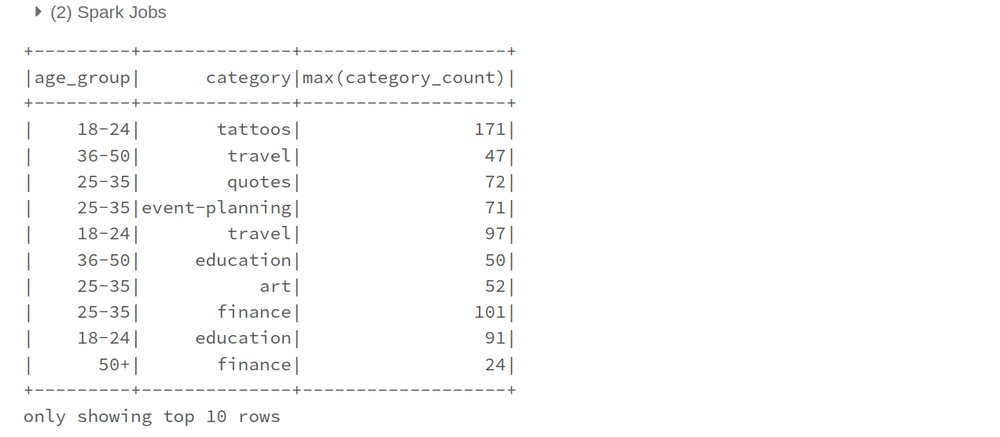
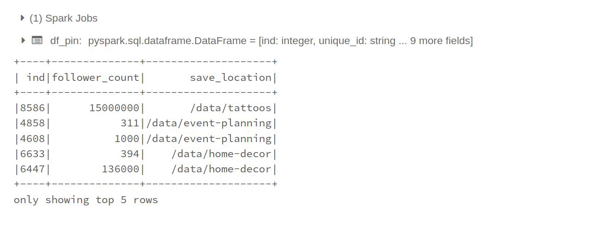
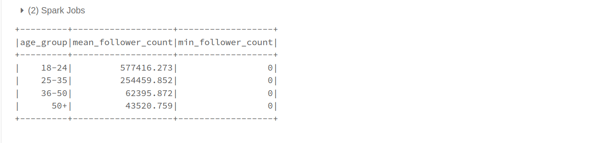

# Pinterest Data Pipeline

## Table of Contents
- [Description](#description)
- [File Structure](#file-structure)
- [Installation](#installation)
- [Usage Instructions](#usage-instructions)
- [Licence information](#licence)

### Description
The primary aim of this project is the design and implementation of a robust Pinterest data pipeline that ingests a high volume data at an efficient rate. This entailed the orchestration of diverse cutting-edge technologies, including EC2, S3, Kafka, MSK cluster, SQL, API Gateway, Spark, Databricks, AWS MWAA and AWS Kinesis. 

The `emulate_pinterest` method simulates Pinterest user's post to send data to an `API Gateway` by making API `POST` call implemented in the `post_message` message. The API was created to make `ANY HTTP` method call to an `EC2` instance that has `Kafka` installed on it. In effect, the data `produced` by the Pinterest user gets `consumed` on the `Kafka topic.` Using the `MSK Connect` and its `topic-regex` feature, the data is automatically saved on the `S3` bucket.

With the produced data saved on `S3`, we mounted the bucket on the Databricks, cleaning the data and answering key stakeholder's questions as shown on the figure below.
```python
# What is the most popular category people post to based on the following age groups: 18-24, 25-35, 36-50, +50
spark.sql("\
        WITH category_table AS (\
            SELECT\
                CASE\
                    WHEN age BETWEEN 18 AND 24 THEN '18-24' \
                    WHEN age BETWEEN 25 AND 35 THEN '25-35'\
                    WHEN age BETWEEN 36 AND 50 THEN '36-50'\
                    WHEN age > 50 THEN '50+'\
                END AS age_group,\
                category,\
                COUNT(category) category_count\
            FROM pin_user\
            GROUP BY age_group, category\
            )\
        SELECT\
            age_group,\
            category,\
            MAX(category_count)\
        FROM category_table\
        GROUP BY age_group, category"
    ).show(10)
```


This project is completed using the following steps:
- Step 1: Create virtual environment
    - `conda create -n pinterest_env`

- Step 2: Create and configure `EC2` instance
    - Create an `EC2` instance on your AWS account
    - Create a `key-pair` with `.pem` extension that connects your local machine to the `EC2` instance
    - Install and configure Kafka on the `EC2` instance
    - Create Kafka topics (pin-post, geolocation and users) to store data.

- Create an `API` resource on `API Gateway` console

- Step 4: Create `MSK` Cluster
    An `Amazon Managed Streaming for Apache Kafka` is used here to build and run an application that can utilise Apache Kafka to process data. To achieve this goal, an `MSK cluster` was created on the `Amazon MSK` console.

- Step 5: Create MSK Connect to connect to S3
    With `MSK COnnect`, the data stored on the ` Kafka topics` are moved to the `S3` for storage. 
        - Create `S3` bucket on the `Amazon S3` console.
        - Create an `IAM` role for authentication
        - Create a `VPC Endpoint` on the `VPC` console that allows data from the cluster and connector to be sent to `S3`.

- Step 6: Data processing
The `pinterest_batch_processing.py` file implements the `PinterestPost class`. An instance of this `class` can perform `batch processing` and `data streaming`.
    - `Batch processing:` Data are moved in batch and stored in the `S3` using the `post_message` method that makes an `API POST` call to the `MSK` cluster endpoint
    - `Data streaming:` The `pinterest_streaming.py` implements the `stream_message` function that streams the user's post on `Amozon Kinesis`. The `stream_message` function is called by an instance of the `PinterestPost` within the `emulate_pinterest` method whenever the argument `batch = False`.

- Step 7: Data transformation on `Databricks`
    - `Batch data:` The batch data on the `S3` is transformed with following steps:
        - Read the `AWS` credebtials
            ```
            aws_keys_df = spark.read.format(file_type)\
                .option("header", first_row_is_header)\
                .option("sep", delimiter)\
                .load("/FileStore/tables/authentication_credentials.csv")
            ```
        - Mount `S3` on `Databricks`. 
            ```python
            dbutils.fs.mount(SOURCE_URL, MOUNT_NAME) # RUN ONCE ONLY!
            ```
        - Data Cleaning
            ```py
                # Perform the necessary transformations on the follower_count to ensure every entry is a number. Make sure the data type of this column is an int.
                df_pin = df_pin.withColumn("follower_count", \
                    when(\
                        (df_pin.follower_count.contains('k')),\
                        1000*regexp_replace(\
                            df_pin["follower_count"], 'k', '')\
                            .cast('int'))
                    .when(\
                        (df_pin.follower_count.contains('M')),\
                        1000000*regexp_replace(\
                            df_pin['follower_count'], 'M', '')\
                            .cast('int'))
                    .otherwise(df_pin.follower_count).cast('int'))
                
                df_pin.select('ind','follower_count', 'save_location', ).show(5)
            ```
            

    - `Streaming data:` The streaming data on `Kinesis` is loaded on to the `Databricks` and transformed using the following streams:
        - Read the `AWS` credentials
        - Read the `streaming data`
            ```py
                # Stream pin post
                df_pin = spark \
                    .readStream \
                    .format('kinesis') \
                    .option('streamName','streaming-12853887c065-pin') \
                    .option('initialPosition','earliest') \
                    .option('region','us-east-1') \
                    .option('awsAccessKey', ACCESS_KEY) \
                    .option('awsSecretKey', SECRET_KEY) \
                    .load()
            ```
- Step 8: Data Querying
The batch data is queried to answer stakeholders question. For example: `What is the mean follower count for the different age group?`

```py
    #Join df_pin and df_user
    df_pin_user = df_pin.join(df_user, df_pin.ind==df_user.ind, 'inner')
    #Add age-group col
    df_pin_user = df_pin_user.withColumn('age_group',\
        when((df_pin_user.age >= 18) & (df_pin_user.age <=25), '18-25')
        .when((df_pin_user.age >= 26) & (df_pin_user.age <= 35), '26-35')
        .when((df_pin_user.age >= 36) & (df_pin_user.age <= 50), '36-50')
        .otherwise('50+'))
    # groupby and aggregate
    df_pin_user.groupby('age_group')\
    .agg(sum('follower_count').alias('total_follower_count'),\
        round(mean('follower_count'), 3).alias('mean_follower_count'))\
    .show()
```


- Step 9: Data Loading
The streaming data is loaded to `Delta table` making it accessible to data analysts, scientists for further analysis, senior managers and other stakeholders.
    
```python
# Remove the checkpoint folder first
dbutils.fs.rm("/tmp/kinesis/_checkpoints/", True)

df_pin.writeStream \
    .format("delta") \
    .outputMode("append") \
    .option("checkpointLocation", "/tmp/kinesis/_checkpoints/") \
    .table("12853887c065_pin_table")
```

## File structure
- Post
    - `database_util.py`
        - `Class:` Implements a class that connects to AWS database
        - Methods
            - `__init__:` instantiaties the database credentials
            - `read_db_creds:` reads the database creds
            - `create_db_connector:` Creates an sqlalchemy engine to connect to the  database
    - `pinterest_batch_processing.py`
        - `Class:` Implements the `PinterestPost` class that emulates Pinterest user posts
        - Methods
            - `emulate_pinterest:` Post data from randomly selected rows on the connected AWS database. This method calls `post_message` and `stream_message` when the argument `batch` is `True` or `False` respectively.
            - `run_infinite_post_data_loop:` This runs an infinite user posts that is stored on the `Kafka topic` and automatically moved to `S3` via `MSK` connect. To do that, it calls the `emulate_pinterest` method.
            - `post_message:` This methods make RESTful API request to Apache MSK cluster.
    - `pinterest_streaming.py:` The `stream_message` function is implemented here to make `RESTful API` request that streams the user's post pn `Kinesis.`
- Notebooks
    - `databricks_batch_processing.ipynb`
    - `streaming-pin-post.ipynb`
## Installation
- Create an `EC2` on `Amazon EC2` console.
- Connect to the `EC2` instance
    ```ssh -i <key-pair-name> ec2-user@<public-dns> ```
- Install Kafka on the `EC2`
    - `sudo yum install java-1.8.0` # install java first
    - Download Apache Kafka
        ```py
        wget https://archive.apache.org/dist/kafka/2.8.1/kafka_2.12-2.8.1.tgz
        xzf kafka_2.12-2.8.1.tgz
        ```
    - Download `IAM MSK authentication package`
        `wget https://github.com/aws/aws-msk-iam-auth/releases/download/v1.1.5/aws-msk-iam-auth-1.1.5-all.jar`
    - Add location of the jar file to the `bashrc` file
        - `nano ~/.bashrc`
        - `export CLASSPATH=/path/to/aws-msk-iam-auth-1.1.5-all.jar`
        - `source .bashrc`
    - Configure Kafka to use `IAM`
        - `cd path/to/kafka/installation/folder`
        - `nano client.properties`
        - Configure the client properties with the following settings:
            ```
                # Sets up TLS for encryption and SASL for authN.
                security.protocol = SASL_SSL

                # Identifies the SASL mechanism to use.
                sasl.mechanism = AWS_MSK_IAM

                # Binds SASL client implementation.
                sasl.jaas.config = software.amazon.msk.auth.iam.IAMLoginModule required awsRoleArn="Your Access Role";

                # Encapsulates constructing a SigV4 signature based on extracted credentials.
                # The SASL client bound by "sasl.jaas.config" invokes this class.
                sasl.client.callback.handler.class = software.amazon.msk.auth.iam.IAMClientCallbackHandler
            ```
- Create Kafka topics
    `./kafka-topics.sh --bootstrap-server BootstrapServerString --command-config client.properties --create --topic 'streaming-12853887c065-pin'`
- Start the `EC2`
    ```py
        - cd confluent-7.2.0/bin/
        - ./kafka-rest-start /home/ec2-user/confluent-7.2.0/etc/kafka-rest/kafka-rest.properties
    ```
## Usage
- Setting up the virtual environment
    ```python
        git clone https://github.com/NwaObed/pinterest-data-pipeline.git

        conda env create -f pinterest_env.yaml -n <new-env>
    ```
    This will emulate the virtual environment from the `pinterest_env.yaml` file and install the `dependencies.`
- Start user posting
    `python3 run_infinite_post_data_loop`
    As the data is stored on the Kafka topics, it is automatically moved to `S3` using the `MSK Connect`.

- Upload notebook to databricks
    - On your databricks account, click on file
    - Click on `Import Notebook`
    - Drag and drop the notebook or browse to the location of the `Notebook` folder
    - Click on `Import`

## Licence information
[Back to Table of Contents](#table-of-contents)